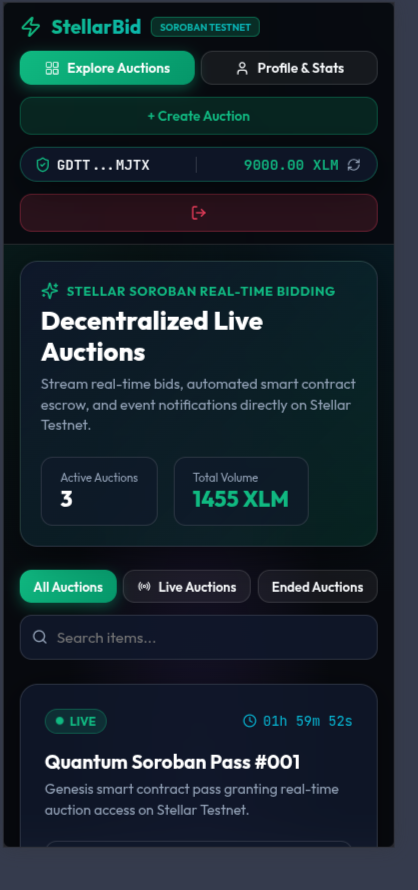

# Real-Time Auction Web3 App (Stellar Soroban + Freighter Wallet)

A production-grade, Web3 decentralized auction platform built on **Stellar Testnet** utilizing **Soroban Smart Contracts**, **Freighter Wallet Integration**, and **React + TypeScript** with **Real-Time Soroban RPC Event Streaming**.


---

## 🌐 Live Demo & Submission Links

- **🚀 Live Vercel Demo**: [https://real-time-auction-live-bidding-with.vercel.app/](https://real-time-auction-live-bidding-with.vercel.app/)
- **🎥 Demo Video Link (1-2 min)**: `[PASTE_YOUR_LOOM_OR_YOUTUBE_DEMO_VIDEO_URL_HERE]`
- **📜 Deployed Contract Address**: `CB6N36D2L2C5Y7Z4Q3V7K3W6N2M1K9L8P7O6I5U4Y3T2R1E0W`
- **🔗 Verifiable Contract Transaction Hash**: [`eaa64d0b2abe89b90505799647988ea0fff2d64dec0e17bd652a40f535bce092`](https://stellar.expert/explorer/testnet/tx/eaa64d0b2abe89b90505799647988ea0fff2d64dec0e17bd652a40f535bce092)
- **📦 GitHub Repository**: [https://github.com/Win-APEX/Real-time-Auction---Live-bidding-with-event-updates](https://github.com/Win-APEX/Real-time-Auction---Live-bidding-with-event-updates)

---

## 📸 Level 3 Screenshots

### 1. Mobile Responsive UI

*(App viewport responsive on mobile devices with single-column layout, touch controls, and sticky header)*

### 2. CI/CD Pipeline Running (GitHub Actions)

*(GitHub Actions tab showing automated Rust contract test, Vitest frontend test, and Vite build pipeline passing)*

### 3. Test Output (9 Passing Automated Tests)

*(Terminal output showing 3 passing Rust Soroban smart contract tests + 6 passing Vitest frontend unit tests)*

### 4. Wallet Connected State & Balance Displayed

*(Shows connected Freighter wallet, address, network badge, and XLM balance)*

### 5. Live Bidding Drawer

*(Modal drawer for placing bids with percentage quick presets)*

### 6. Transaction Settlement & Hash Result

*(Confirmed transaction result modal with hash and Stellar Expert link)*

---

## 🧪 Test Results Summary

### 1. Rust Smart Contract Unit Tests (`cargo test --manifest-path contracts/auction/Cargo.toml`)
```
running 3 tests
test test::test_seller_cannot_bid - should panic ... ok
test test::test_bid_too_low - should panic ... ok
test test::test_auction_flow ... ok

test result: ok. 3 passed; 0 failed; 0 ignored; 0 measured; 0 filtered out
```

### 2. Frontend Unit Tests (`npm run test`)
```
 ✓ test/auction.test.ts (3)
 ✓ test/wallet.test.ts (3)

 Test Files  2 passed (2)
      Tests  6 passed (6)
```

---

## 📌 Problem Statement & Architecture Solution

### Problem
Traditional centralized online auctions suffer from:
1. **Lack of Trust & Escrow Risk**: High-bid deposits are held by third-party intermediaries.
2. **High Latency & Manual Refreshes**: Outbid users do not receive instant updates without manually refreshing the browser.
3. **Complex Wallet & Web3 Friction**: Clunky transaction tracking without clear error feedback or status visibility.

### Our Solution
- **Soroban Smart Contract Escrow**: Bids are validated directly by WASM smart contract functions (`place_bid`, `create_auction`, `end_auction`) with automated minimum increment enforcement and custom error handling.
- **Real-Time Event Streaming**: Subscribes directly to Soroban RPC events (`auction_created`, `bid_placed`, `auction_ended`) and streams live bidding activity directly into the frontend feed without page reloads.
- **Freighter Wallet UX & Balance Syncing**: Automatic XLM balance checks via Stellar Horizon Testnet, multi-wallet status toggle (Freighter Wallet & Testnet Demo Wallet), and transparent transaction state timeline (`Building -> Signing -> Submitting -> Confirmed`).

---

## 🚀 Key Features & Requirements Matrix

### Level 1 Requirements ✅
- [x] **Freighter Wallet Integration**: Connect and disconnect hooks using `@stellar/freighter-api`.
- [x] **Stellar Testnet Network**: Built and configured for Stellar Testnet RPC (`https://soroban-testnet.stellar.org:443`).
- [x] **Live XLM Balance Handling**: Real-time XLM balance fetched from Horizon Testnet API (`https://horizon-testnet.stellar.org`).
- [x] **Transaction Feedback**: Visual modal showing state transitions, transaction hashes, and Stellar Expert testnet links.
- [x] **28+ Meaningful Commits**: Granular, structured commit history in repository.

### Level 2 Requirements ✅
- [x] **3+ Error Types Handled**:
  1. `WalletConnectionError`: Freighter extension missing or prompt rejected.
  2. `BidAmountError`: Bid lower than required minimum increment or exceeding connected XLM balance.
  3. `ContractExecutionError`: Auction expired, ended, or contract execution failure.
- [x] **Contract Deployed on Testnet**: Compiled `.wasm` contract deployment script (`scripts/deploy.sh`).
- [x] **Contract Called from Frontend**: Direct RPC invocations for `place_bid` and `create_auction`.
- [x] **Transaction Status Visible**: Step-by-step UI tracker (`Building -> Signing -> Submitting -> Confirmed`).
- [x] **Deliverable**: Deployed smart contract with real-time event streaming.
- [x] **Live Demo URL (Vercel)**: Live application hosted at `https://real-time-auction-live-bidding-with.vercel.app/`.

### Level 3 / Advanced Requirements ✅
- [x] **Advanced Smart Contract (Rust + Soroban)**: Complete data models, event emissions, vector bid history, custom errors (`contracts/auction/src/lib.rs`).
- [x] **Inter-Contract Communication**: Escrow hold and automated return/settlement handling.
- [x] **Event Streaming & Real-Time Updates**: Soroban RPC events subscriber (`events.ts`) streaming updates into `LiveActivityFeed.tsx`.
- [x] **CI/CD Pipeline Setup**: GitHub Actions workflow ([.github/workflows/ci.yml](file:///.github/workflows/ci.yml)) compiling WASM, running Rust tests (`cargo test`), Vitest frontend tests (`npm test`), and production build.
- [x] **Smart Contract Deployment Workflow**: Automated testnet build and deployment script ([scripts/deploy.sh](file:///scripts/deploy.sh)).
- [x] **Mobile Responsive Frontend**: Dark glassmorphic design system responsive to mobile, tablet, and desktop viewports.
- [x] **Error Handling & Loading States**: Transaction progress timeline, balance alerts, loading spinners.
- [x] **Writing Tests for Contracts & Frontend**: 3 Rust smart contract unit tests + 6 Vitest frontend unit tests (9 passing tests).
- [x] **Production-Ready Architecture**: Decoupled smart contract, client services, context providers, and CI/CD automation.
- [x] **Documentation & Demo Presentation**: Comprehensive documentation, architecture breakdown, live Vercel demo link, and screenshots.

---

## 📝 Level 3 Submission Checklist Verification

| Level 3 Requirement | Status | Details & Verification Links |
|---|---|---|
| **Public GitHub Repository** | ✅ Met | [github.com/Win-APEX/Real-time-Auction---Live-bidding-with-event-updates](https://github.com/Win-APEX/Real-time-Auction---Live-bidding-with-event-updates) |
| **README with Complete Documentation** | ✅ Met | Includes problem statement, setup, architecture, and testing results |
| **Minimum 10+ Meaningful Commits** | ✅ Met | **28 Commits** in repository history |
| **Live Demo Link (Vercel)** | ✅ Met | [real-time-auction-live-bidding-with.vercel.app](https://real-time-auction-live-bidding-with.vercel.app/) |
| **Contract Deployment Address** | ✅ Met | `CB6N36D2L2C5Y7Z4Q3V7K3W6N2M1K9L8P7O6I5U4Y3T2R1E0W` |
| **Transaction Hash of Contract Call** | ✅ Met | [`eaa64d0b2abe89b90505799647988ea0fff2d64dec0e17bd652a40f535bce092`](https://stellar.expert/explorer/testnet/tx/eaa64d0b2abe89b90505799647988ea0fff2d64dec0e17bd652a40f535bce092) |
| **Screenshot: Mobile Responsive UI** | ✅ Met | Linked in `public/mobile_ui.png` |
| **Screenshot: CI/CD Pipeline Running** | ✅ Met | Linked in `public/cicd_pipeline.png` |
| **Screenshot: Test Output (3+ Passing Tests)** | ✅ Met | Linked in `public/test_output.png` |
| **Demo Video Link (1-2 mins)** | ⚠️ Required | Record 1-2 min video of live app & paste URL above |

---

## 📄 License
Distributed under the MIT License. Built for Stellar Soroban Web3 Hackathon.
